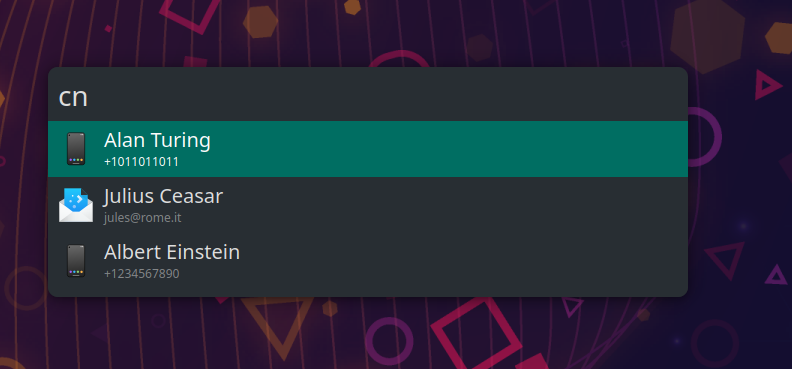
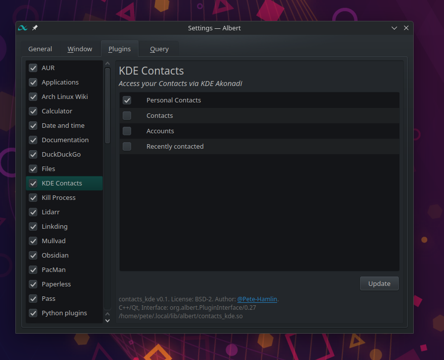

# KDE Contacts albert extension




An extension to view your email/phone contacts in the [albert](https://albertlauncher.github.io/) launcher via [akonadi](https://api.kde.org/kdepim/akonadi/html/client_libraries.html).
Uses an `IndexQueryHandler`, so supports both triggered and global queries.

Tested on KDE, though in theory should work on any system that has KDEPIM installed.

## Installation

### Dependencies

You will need the following installed:

- [albert](https://albertlauncher.github.io/) - Should be obvious.
- [cmake](https://cmake.org/) - Should be available via system package manager.
- [libakonadi](https://api.kde.org/kdepim/akonadi/html/client_libraries.html) - Should be available via system package manager, though name may vary depending on distro.

### Building

If you have [just](https://github.com/casey/just) installed, you can use either of the following shortcuts:

```sh
# One-liner
just default

# As 2 commands
just build
just install
```

Otherwise, manually running the commands:

```sh
mkdir -p $HOME/.local/lib/albert/
mkdir build && cd build/

cmake -DCMAKE_EXPORT_COMPILE_COMMANDS=1 .. -DCMAKE_PREFIX_PATH=/usr/lib/$(gcc -dumpmachine)/cmake/
cmake --build . -j$(nproc)
make

cp bin/contacts_kde.so $HOME/.local/lib/albert/
```

This will build and install the `contacts_kde.so` object in `$HOME/.local/lib/albert/`.

## Usage

Use the in-app settings to select which akonadi collections you would like to index.
Extension will fetch all viable collections (those that contain

Default trigger is `cn` to show contacts.
Contacts will appear in global queries by default, but can be disabled via settings.

## Credits

[@ManuelSchneid3r](https://github.com/ManuelSchneid3r) for creating albert and its [plugins](https://github.com/albertlauncher/plugins), from which this extension draws from heavily.
